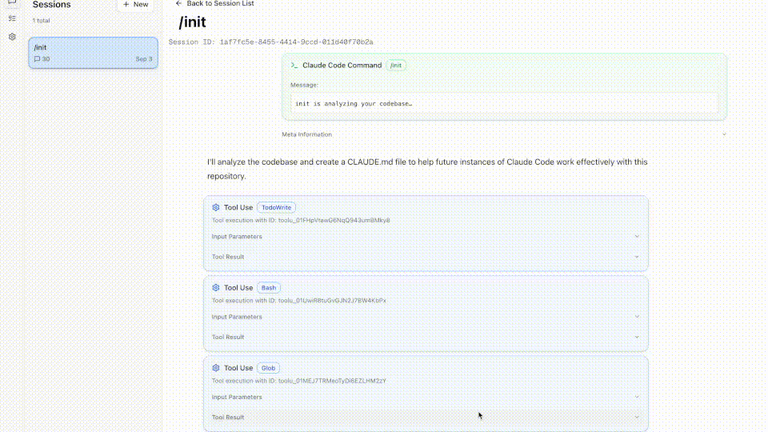

# Claude Code Viewer

A full-featured web-based Claude Code client that provides complete interactive functionality for managing Claude Code projects. Start new conversations, resume existing sessions, monitor running tasks in real-time, and browse your conversation history - all through a modern web interface.



## Overview

Claude Code Viewer is a web-based Claude Code client focused on **lossless session log analysis**. It preserves and effectively organizes all conversation information through strict schema validation and progressive UI disclosure.

**Core Philosophy**: Zero data loss + Effective organization + Remote-friendly design

## Features

### Interactive Claude Code Client

- **New Chat Creation** - Start new Claude sessions directly from the web interface
- **Session Resumption** - Continue paused Claude conversations with full context
- **Real-time Task Management** - Monitor, control, and abort running Claude tasks
- **Command Autocompletion** - Smart completion for both global and project-specific Claude commands
- **Live Status Indicators** - Visual feedback for running, paused, and completed tasks

### Real-time Synchronization

- **Server-Sent Events (SSE)** - Instant bidirectional communication and updates
- **File System Monitoring** - Automatic detection of conversation file changes
- **Live Task Updates** - Real-time progress tracking for active Claude sessions
- **Auto-refresh UI** - Instant updates when conversations are modified externally

### Advanced Conversation Management

- **Project Browser** - View all Claude Code projects with metadata and session counts
- **Smart Session Filtering** - Hide empty sessions, unify duplicates, filter by status
- **Multi-tab Interface** - Sessions, Tasks, and Settings in an organized sidebar
- **Conversation Display** - Human-readable format with syntax highlighting and tool usage
- **Command Detection** - Enhanced display of XML-like command structures
- **Task Controller** - Full lifecycle management of Claude processes

### Built-in Development Tools

- **Git Diff Viewer** - Comprehensive branch comparison with file-by-file diff visualization
- **Remote Development Ready** - Full web-based access ideal for remote work and server environments
- **Branch & Commit Browser** - Navigate git history directly within the interface
- **Untracked File Support** - View diffs for untracked files alongside committed changes

## Installation & Usage

### Quick Start (CLI)

Run directly from npm without installation:

```bash
PORT=3400 npx @kimuson/claude-code-viewer@latest
```

Alternatively, install globally:

```bash
npm install -g @kimuson/claude-code-viewer
claude-code-viewer
```

The application uses pnpm as the package manager (v10.8.1) and is published as version 0.1.0.

The server will start on port 3400 (or the specified PORT). Open `http://localhost:3400` in your browser.

### Alternative Installation

Clone and run locally:

```bash
git clone https://github.com/d-kimuson/claude-code-viewer.git
cd claude-code-viewer
pnpm i
pnpm build
pnpm start
```

## Data Source

The application reads Claude Code conversation files from:

- **Location**: `~/.claude/projects/<project>/<session-id>.jsonl`
- **Format**: JSONL files containing conversation entries
- **Auto-detection**: Automatically discovers new projects and sessions

## Usage Guide

### 1. Project List

- Browse all Claude Code projects
- View project metadata (name, path, session count, last modified)
- Click any project to view its sessions

### 2. Session Browser  

- View all conversation sessions within a project
- Filter to hide empty sessions
- Sessions show message counts and timestamps
- Click to view detailed conversation

### 3. Conversation Viewer

- Full conversation history with proper formatting
- Syntax highlighting for code blocks
- Tool usage and results clearly displayed
- Navigation sidebar for jumping between sessions
- Support for different message types (user, assistant, system, tools)

## Configuration

### Port Configuration

Set a custom port using the `PORT` environment variable:

```bash
PORT=8080 npx @kimuson/claude-code-viewer@latest
```

### Data Directory

The application automatically detects the standard Claude Code directory at `~/.claude/projects/`. No additional configuration is required.

## Alternatives & Differentiation

Several excellent Claude Code web clients exist, each with their own strengths:

- https://github.com/sugyan/claude-code-webuisupport
- https://github.com/wbopan/cui
- https://github.com/siteboon/claudecodeui

**Claude Code Viewer's Focus**: While these tools excel as general-purpose web clients, Claude Code Viewer specializes as a **session log viewer** with:

- **Zero Information Loss**: Strict Zod schema validation preserves every conversation detail
- **Progressive Organization**: Expandable elements and sub-session modals manage information density
- **Built-in Git Diff Viewer**: Comprehensive branch comparison for remote development
- **Session Flow Analysis**: Complete conversation tracking across multiple sessions

Each tool serves different use cases - choose the one that best fits your workflow and priorities.

## License

This project is available under the MIT License.

## Contributing

See [docs/dev.md](docs/dev.md) for detailed development setup and contribution guidelines.
